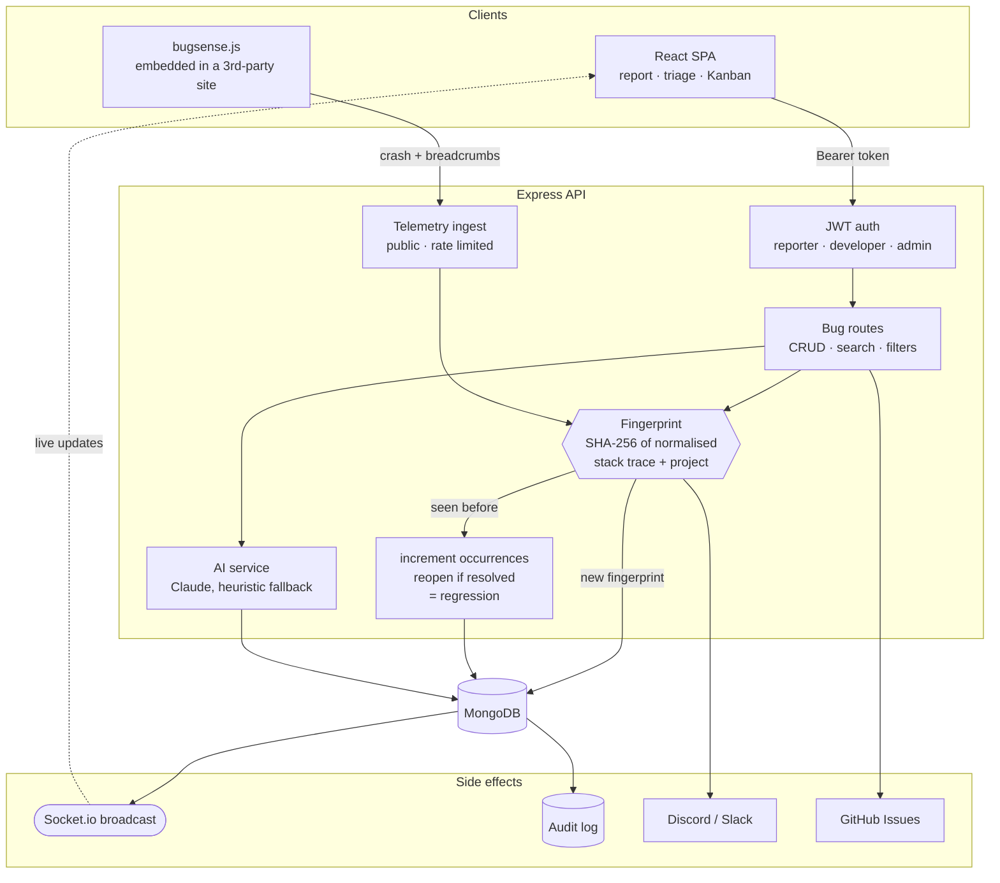

# BugSense — Smart Bug Reporting & AI Debug Assistant

[](https://github.com/krishnendu-9/bugsense/actions)


> A production-grade, fault-tolerant MERN stack application that transforms chaotic bug reports into structured, real-time, AI-powered debug sessions.

---

## Run it in 60 seconds

No API keys and no config. The full stack — MongoDB, the Express API and the
React client behind nginx — comes up with two commands:

```bash
git clone https://github.com/krishnendu-9/bugsense.git
cd bugsense
docker compose up --build

# in a second terminal, load 3 demo users and 4 sample bugs
docker compose exec server npm run seed
```

Then open **http://localhost:5173** and sign in with:

| Role | Email | Password |
|---|---|---|
| Admin | `admin@bugsense.dev` | `password123` |
| Developer | `dev@bugsense.dev` | `password123` |
| Reporter | `reporter@bugsense.dev` | `password123` |

The whole application is explorable with zero configuration. Without
`ANTHROPIC_API_KEY`, root-cause analysis falls back to keyword heuristics and
post-mortems to a data-filled template — both clearly labelled as such in the UI —
and patch generation reports that it is unavailable rather than inventing code.
Add a key to see Claude drive all three.

---

## Why I Built This

Bug reports are the worst part of software development — not because bugs exist, but because reports are incomplete. Developers waste hours asking "what browser?", "what error?", "can you reproduce it?". BugSense eliminates that friction: it auto-captures browser context, guides reporters through structured reproduction steps, and uses Claude AI to instantly diagnose error logs and suggest fixes.

---

## Features

- **One-Click CSV & JSON Data Export** — Export every incident matching the current filters to CSV (formula-injection safe) or JSON
- **In-App Webhook Settings & Live Test Ping** — Each user configures their own Discord/Slack webhooks with alert preferences (new critical incidents, regressions) and a 1-click test ping
- **Live System Vitals & Health Metrics (`/metrics`, staff only)** — Real-time Node.js process heap, MongoDB connectivity status, uptime counters, and telemetry deduplication efficiency analytics
- **Audit Trail (`/audit`, staff only)** — Paginated activity log of bug creation, updates and deletion, telemetry incidents and regressions, and GitHub exports
- **Embeddable Client SDK (`bugsense.js`)** — Zero-dependency agent any web app can install to auto-capture crashes and inject an in-app bug report pill; never records typed input, strips query strings from URLs, and can be torn down with `BugSense.destroy()`
- **Flight Recorder Breadcrumbs** — Automatically records the user's last 15 actions (DOM clicks, page navigation, fetch API calls, and console logs) leading up to an incident
- **Error Fingerprinting & Deduplication** — Deterministic SHA-256 stack trace hashing groups recurring SDK errors with atomic, race-safe occurrence counters (e.g. `42x occurrences`) and flags regressions; manual reports are never merged, but similar existing reports are pointed out
- **AI Pull Request & Patch Generator** — Claude proposes unified Git diffs with syntax highlighting and copyable `git apply` commands (requires an API key)
- **Interactive SDK Sandbox (`/sdk-demo`)** — Built-in simulated customer storefront allowing developers to inject real-world browser exceptions, failing API calls, and async rejections to demonstrate live telemetry ingestion
- **AI Incident Post-Mortem Generator** — Formal engineering post-mortem synthesis in GitHub-flavored Markdown covering Executive Summary, Breadcrumb Timeline, RCA, and Action Items with 1-click `.md` download
- **Real-Time Kanban Workflow Board (`/board`)** — Linear-style collaborative issue board featuring quick stage shifts (`Open`, `In Progress`, `Resolved`, `Closed`) synchronized via Socket.io
- **GitHub Issues 1-Click Export** — Convert any bug report into an official GitHub Issue via GitHub REST API with stack traces and AI diagnostics attached
- **Discord & Slack Webhooks** — Alerts for new and regressed incidents, sent only to genuine Discord/Slack webhook URLs
- **Structured Bug Reporting** — Rich text descriptions, numbered reproduction steps, auto-captured browser/OS metadata
- **Screenshot Uploads & Fabric.js Markup** — Drag-and-drop screenshot upload with canvas markup (pencil, lines, rectangles, ellipses)
- **Real-Time Collaboration** — Authenticated Socket.io live updates for status changes, assignments, new incidents, and comments
- **AI-Powered Diagnostics** — Claude diagnoses root causes and suggests actionable fix steps; offline heuristic results are labelled as heuristics
- **Profile & Settings** — Manage display names, avatar uploads, and bcrypt password changes that sign out every other session
- **Security** — Server- and client-side HTML sanitization, role-based access control on every mutating route, authenticated WebSockets, SSRF-safe webhooks, optional SDK ingest key, multi-tier rate limiting, and Helmet headers
- **Developer Dashboard** — Recharts metrics, priority distributions, and recent incident streams
- **Dark Theme Glassmorphism** — Sleek modern aesthetic built entirely in Tailwind CSS

---

## Tech Stack

| Layer | Technology |
|-------|-----------|
| Frontend Framework | React 18 (Vite) |
| Styling | Tailwind CSS v3 |
| Routing | React Router DOM v6 |
| HTTP Client | Axios |
| Forms | React Hook Form |
| Rich Text | React Quill |
| Canvas Annotations | Fabric.js |
| Icons | Lucide React |
| Charts | Recharts |
| Notifications | React Hot Toast |
| Date Formatting | date-fns |
| Backend | Node.js + Express.js |
| Database | MongoDB + Mongoose |
| Authentication | JWT + bcryptjs |
| File Uploads | Multer |
| Validation | express-validator |
| Real-time | Socket.io (server + client) |
| Security | Helmet, CORS, express-rate-limit |
| AI | Anthropic SDK (Claude Sonnet) |
| Logging | Morgan |
| Linting | ESLint 9 (flat config, both packages) |
| Containers | Docker + Docker Compose + nginx |
| CI | GitHub Actions (lint, build, image builds) |

---

## Architecture

Two ways in: a human filing a structured report, or an SDK in someone else's app
reporting a crash automatically. Both converge on the same fingerprint-and-dedup
pipeline, and every write fans back out over WebSockets.



**The part worth reading the code for** is the fingerprint step. Incoming stack
traces are normalised — UUIDs, memory addresses, timestamps and line numbers
stripped — then hashed with the project name. Identical crashes collapse into one
incident with an occurrence counter instead of a thousand duplicate rows, and a
crash that reappears after being marked resolved is automatically flagged as a
regression. See [`fingerprint.util.js`](server/utils/fingerprint.util.js).

---

## Project Structure

```
bugsense/
├── .github/workflows/        # CI: lint, tests, build, docker image builds
├── docker-compose.yml        # Full stack: MongoDB + API + nginx client
├── client/                   # React frontend (Vite)
│   ├── eslint.config.js
│   ├── nginx.conf            # Proxies /api, /uploads, /sdk, /socket.io
│   ├── Dockerfile
│   └── src/
│       ├── api/              # Axios instance with auth interceptor
│       ├── components/
│       │   ├── ai/           # ErrorInsights, GitPatchModal, PostMortemModal
│       │   ├── bugs/         # BugCard, BugForm, BugFilters, StepsReproducer,
│       │   │                 # AnnotationCanvas, BreadcrumbTimeline
│       │   ├── common/       # Navbar, Sidebar, Loader, Badge, ProtectedRoute,
│       │   │                 # ErrorBoundary, RoleRoute
│       │   └── dashboard/    # StatsCard, BugChart, RecentBugs
│       ├── context/          # AuthContext, SocketContext
│       ├── hooks/            # useAuth, useBugs, useAI, useSocket, useDebouncedValue
│       ├── pages/            # auth/, bugs/ (list, detail, report, kanban),
│       │                     # dashboard/, ai/, audit/, metrics/,
│       │                     # playground/, profile/
│       └── utils/            # constants, helpers
└── server/                   # Express backend
    ├── eslint.config.js
    ├── Dockerfile
    ├── app.js                # Express app (imported by server.js and the tests)
    ├── server.js             # Entry point: DB connection, HTTP + Socket.io server
    ├── config/               # MongoDB, Socket.io
    ├── controllers/          # auth, bug, comment, ai, user, telemetry, audit
    ├── middleware/           # auth, upload, rateLimit, error
    ├── models/               # User, Bug, Comment, AuditLog
    ├── public/sdk/           # bugsense.js — the embeddable client SDK
    ├── routes/               # auth, bugs, comments, ai, users, telemetry, audit
    ├── scripts/              # seed.js
    ├── services/             # ai, token, audit, webhook, bugEvents
    ├── tests/                # node:test + Supertest API and unit tests
    ├── utils/                # fingerprint, sanitize, permissions, webhookUrl,
    │                         # uploads, aiBudget
    └── uploads/              # Multer file storage
```

---

## Setup & Installation

### Prerequisites

- Node.js 20+
- MongoDB (local or Atlas)
- Anthropic API key (optional — AI features degrade gracefully without it)

### 1. Clone the repository

```bash
git clone https://github.com/krishnendu-9/bugsense.git
cd bugsense
```

### 2a. Run with Docker (fastest)

Run the full stack (MongoDB, Express API, and Nginx React Client) with a single command:

```bash
cp .env.example .env    # optional: add ANTHROPIC_API_KEY and a real JWT_SECRET
docker compose up --build
```

- App (and API under `/api`): [http://localhost:5173](http://localhost:5173)

The client image is built with `VITE_API_URL=/api`, so all browser traffic goes
through nginx, which proxies `/api`, `/uploads`, `/sdk` and `/socket.io`
to the server container. The server itself is not published on a host port, and
MongoDB is bound to `127.0.0.1` only. The server runs with `NODE_ENV=production`,
so set a real `JWT_SECRET` in `.env` before exposing it anywhere.

---

### 2b. Or run locally with Node.js

```bash
cd server
npm install
cp .env.example .env
```

Edit `server/.env`:

```env
PORT=5000
MONGO_URI=mongodb://localhost:27017/bugsense
JWT_SECRET=your_super_secret_jwt_key_here
ANTHROPIC_API_KEY=sk-ant-...
CLIENT_URL=http://localhost:5173
```

Start the backend:

```bash
npm run dev
```

### 3. Frontend setup

```bash
cd client
npm install
```

Create `client/.env`:

```env
VITE_API_URL=http://localhost:5000/api
```

Start the frontend:

```bash
npm run dev
```

### 4. Seed demo data (optional)

```bash
cd server
npm run seed
```

Creates three demo accounts and four sample bugs. Seeding **deletes all data**, so it
refuses to run on a database that already has users; use `npm run seed:reset` to
wipe and reseed deliberately.

### 5. Lint & test

Both packages are linted with ESLint (flat config). The server has an API test
suite (Node's built-in test runner + Supertest) that runs against an in-memory
MongoDB, covering auth, permissions, XSS sanitization, SSRF protection, telemetry
deduplication and socket authentication. CI runs all of it on every push.

```bash
cd server && npm run lint && npm test
cd client && npm run lint
```

Set `MONGO_URI_TEST` to run the tests against an existing MongoDB instead
(use a dedicated database — the suite drops it).

### 6. Open in browser

Navigate to [http://localhost:5173](http://localhost:5173)

---

## API Endpoints

### Authentication `/api/auth`

| Method | Endpoint | Description | Auth |
|--------|----------|-------------|------|
| POST | `/register` | Register new user | — |
| POST | `/login` | Login, returns JWT | — |
| GET | `/me` | Get current user | Bearer |

### Bugs `/api/bugs`

| Method | Endpoint | Description | Auth |
|--------|----------|-------------|------|
| GET | `/` | List bugs (filter: `status`, `priority`, `assignedTo`, `reporter`, `project`, `search`, `page`, `limit`) | Bearer |
| POST | `/` | Create bug | Bearer |
| GET | `/stats` | Dashboard statistics | Bearer |
| GET | `/:id` | Single bug with comments | Bearer |
| PUT | `/:id` | Update bug (whitelisted fields only) | Bearer |
| DELETE | `/:id` | Delete bug | Admin only |
| POST | `/:id/screenshot` | Upload screenshot (multipart `screenshot`) | Bug reporter / Staff |
| POST | `/:id/annotation` | Upload annotated screenshot (multipart `annotation`) | Bug reporter / Staff |
| POST | `/:id/github` | Export bug as a GitHub Issue | Staff |

### Comments `/api/comments`

| Method | Endpoint | Description | Auth |
|--------|----------|-------------|------|
| POST | `/` | Add comment | Bearer |
| GET | `/bug/:bugId` | Get comments for a bug | Bearer |
| DELETE | `/:id` | Delete comment | Author/Admin |

### AI `/api/ai`

| Method | Endpoint | Body | Returns | Auth |
|--------|----------|------|---------|------|
| POST | `/analyze` | `{ errorLog, bugContext?, bugId? }` | `{ possibleCause, suggestedFix, source }` | Bearer |
| POST | `/generate-patch` | `{ bugId?, errorLog?, bugDescription?, steps? }` | `{ diff, explanation, source, generatedAt }` | Bearer |
| POST | `/post-mortem` | `{ bugId }` | `{ markdown, source, generatedAt }` | Bearer |

`source` says what produced the result: `claude`, or without an API key `heuristic` (analysis), `template` (post-mortem) or `unavailable` (patch — the `diff` is empty). Passing `bugId` saves the result on that bug, which requires permission to edit it.

### Users `/api/users`

| Method | Endpoint | Description | Auth |
|--------|----------|-------------|------|
| GET | `/assignable` | Developers and admins a bug can be assigned to | Staff |
| GET | `/profile` | Get current user profile | Bearer |
| PUT | `/profile` | Update name / change password (returns a fresh token; other sessions are revoked) | Bearer |
| POST | `/avatar` | Upload profile avatar | Bearer |
| PUT | `/webhooks` | Save Discord/Slack webhook settings | Bearer |
| POST | `/webhooks/test` | Send a test alert to a webhook | Bearer |

### Telemetry `/api/telemetry`

| Method | Endpoint | Description | Auth |
|--------|----------|-------------|------|
| POST | `/report` | SDK crash/feedback ingestion with fingerprint deduplication | Public, rate limited; `X-BugSense-Key` when `TELEMETRY_INGEST_KEY` is set |

### Audit `/api/audit`

| Method | Endpoint | Description | Auth |
|--------|----------|-------------|------|
| GET | `/` | Paginated activity log (filter: `entityType`, `action`) | Staff |

### Health `/api/health`

| Method | Endpoint | Description | Auth |
|--------|----------|-------------|------|
| GET | `/` | Liveness probe | — |
| GET | `/metrics` | Uptime, heap, Mongo status, dedup efficiency | Staff |

*Staff* means the `developer` or `admin` role. Sockets require the same JWT, passed as `auth.token` in the Socket.io handshake.

---

## Embedding the Client SDK

`bugsense.js` is a zero-dependency agent any web app can drop in. It records the
last 15 user actions, auto-reports uncaught errors and unhandled rejections, and
injects a floating "Report Bug" widget.

```html
<script
  src="https://your-bugsense-host/sdk/bugsense.js"
  data-api-url="https://your-bugsense-host"
  data-project="My Client App"
  data-key="your-ingest-key"
></script>
```

| Attribute | Default | Description |
|-----------|---------|-------------|
| `data-api-url` | `http://localhost:5000` | Base URL of the BugSense API |
| `data-project` | `Production Web App` | Project name recorded on every incident |
| `data-widget` | `true` | Set to `"false"` to suppress the floating report pill |
| `data-key` | — | Ingest key, required when the server sets `TELEMETRY_INGEST_KEY` |

Manual capture:

```js
window.BugSense.captureError(err, 'Checkout failed');
window.BugSense.captureMessage('Coupon banner clicked', 'low');
window.BugSense.addBreadcrumb('click', 'User opened the cart drawer');
window.BugSense.destroy(); // restore patched globals and remove the widget
```

**Privacy:** the SDK never records form field values or text from inputs,
textareas, selects, contenteditable regions, or anything inside an element
marked `data-bugsense-mask`. Query strings and fragments are stripped from every
reported URL.

The SDK caps itself at 20 reports per page session and suppresses repeats of the
same error within 10 seconds, so a crash loop in the host page cannot flood the
ingestion endpoint. Try it live at `/sdk-demo`.

---

<!-- SCREENSHOTS — uncomment this block once the six PNGs exist in docs/screenshots/

## Screenshots

| Dashboard | Kanban Board |
|---|---|
|  |  |

| Bug Detail | AI Diagnostics |
|---|---|
|  |  |

| SDK Sandbox | Audit Trail |
|---|---|
|  |  |

---

-->

## Environment Variables Reference

### server/.env

| Variable | Required | Description |
|----------|----------|-------------|
| `PORT` | no | Server port (default: 5000) |
| `MONGO_URI` | no | MongoDB connection string (defaults to `mongodb://localhost:27017/bugsense`) |
| `JWT_SECRET` | in production | Secret key for JWT signing. The server refuses to start without it when `NODE_ENV=production` |
| `ANTHROPIC_API_KEY` | no | Anthropic API key. Without it, AI features fall back to heuristics |
| `CLIENT_URL` | no | Frontend URL, used for CORS and links in webhook alerts |
| `NODE_ENV` | no | Set to `production` to enforce the JWT check and production rate limits |
| `DISCORD_WEBHOOK_URL` | no | Global Discord webhook for incident alerts |
| `SLACK_WEBHOOK_URL` | no | Global Slack webhook for incident alerts |
| `GITHUB_TOKEN` | no | Default token for GitHub Issue export (can also be supplied per request) |
| `TELEMETRY_INGEST_KEY` | no | Shared secret the SDK must send (`data-key`). Unset = open ingestion, fine for local demos |
| `TELEMETRY_ALLOWED_ORIGINS` | no | Comma-separated origins allowed to post telemetry (default: any) |
| `TELEMETRY_AI_HOURLY_BUDGET` | no | Max background AI analyses started by public telemetry per hour (default: 20) |

### client/.env

| Variable | Description |
|----------|-------------|
| `VITE_API_URL` | Backend API base URL — absolute (`https://api.example.com/api`) or relative (`/api`). Sockets and uploads use the same origin |

---

## Design System

Built on a consistent dark theme with glass morphism cards:

- **Primary:** `#6366F1` (Indigo)
- **Secondary:** `#8B5CF6` (Purple)
- **Background:** `#090D16` (Near-black navy)
- **Surface:** `#111827` (Dark slate)
- **Cards:** `bg-white/5 backdrop-blur border border-white/10`

---

## License

MIT
